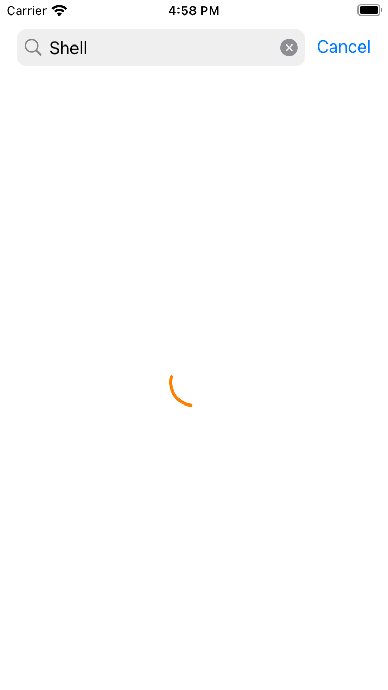
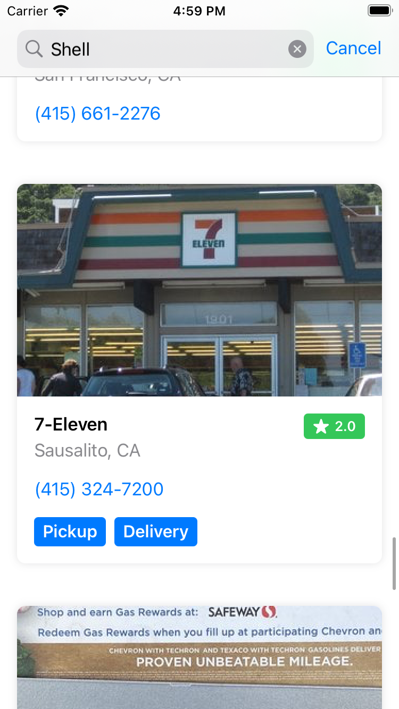
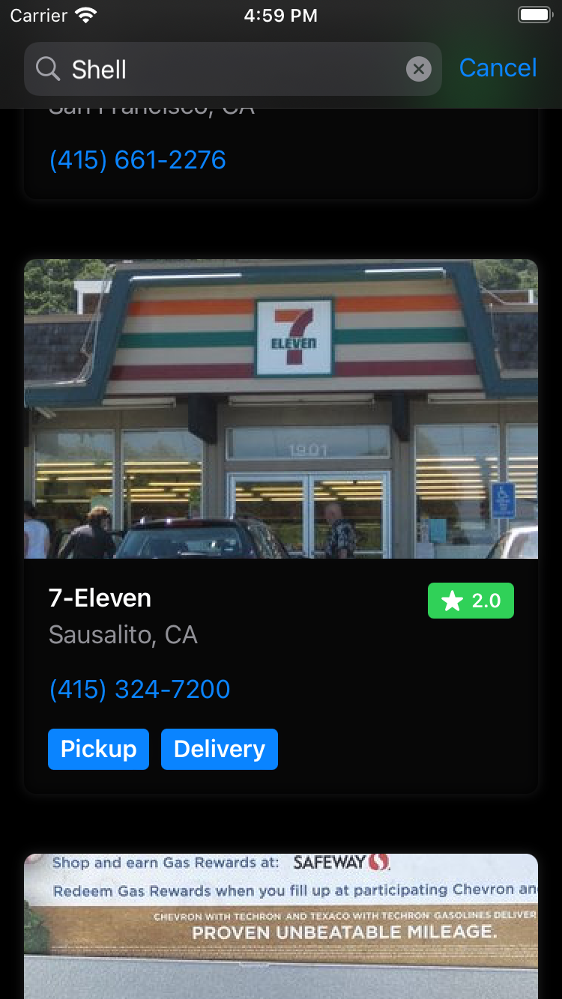

# Yelp Search

Simple SwiftUI app that Search Yelp business. The app is built for educational purpose.

## Requirements

- Xcode: 13.2.1 (13C100)
- Swift: 5.5
- Minimum Deployment Version: iOS 15.0

## Structure

The project's files are structured into three different major category.
1. Core Modules 
2. Feature Abstraction
3. Feature Modules

## Screenshots

|||
|-|-|
|||
|-|-|
|||

## Dependencies

### 1. [Network](https://github.com/karthikkeyan/Network)
The app uses Network as a dependency for this project. This network library is also built by me.

Heres the link of my YouTube's playlist where I have recorded the live coding session with explanation during the development of the Network library.
https://youtube.com/playlist?list=PLh9imjJTJlYiPl8fwXtISvvGVTrTF0Iii

